# Spring 常见设计模式（Java 8 简洁示例 + 类图 + 场景说明）

> 目标：把上一条提到的 Spring 常见设计模式，分别用 **Java 8** 写一个可读、可抄、可改的最小示例。
> 说明：示例强调“模式本身”，并补充其在 Spring 中的对应组件与使用场景。

---

## 1. 单例模式（Singleton）

### Spring 对应
- 默认 Bean 作用域：`singleton`。

### 典型场景
- 无状态服务类，例如 `UserService`、`OrderService`。

### 类图
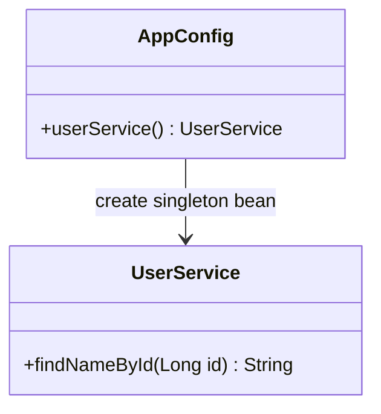

### Java 8 示例
```java
import org.springframework.context.annotation.*;

@Configuration
class AppConfig {
    @Bean
    public UserService userService() {
        return new UserService(); // 默认 singleton
    }
}

class UserService {
    public String findNameById(Long id) {
        return "user-" + id;
    }
}

public class SingletonDemo {
    public static void main(String[] args) {
        AnnotationConfigApplicationContext ctx = new AnnotationConfigApplicationContext(AppConfig.class);
        UserService s1 = ctx.getBean(UserService.class);
        UserService s2 = ctx.getBean(UserService.class);
        System.out.println(s1 == s2); // true
        ctx.close();
    }
}
```

### 说明
- Spring 容器只创建一次 Bean 实例，并在后续注入时复用它。
- 适用于“无状态 + 高复用”对象，减少创建成本。

---

## 2. 工厂模式（Factory）

### Spring 对应
- `BeanFactory` / `ApplicationContext`。
- 自定义 `FactoryBean<T>`。

### 典型场景
- 第三方复杂对象创建（连接池、客户端、会话工厂等）。

### 类图
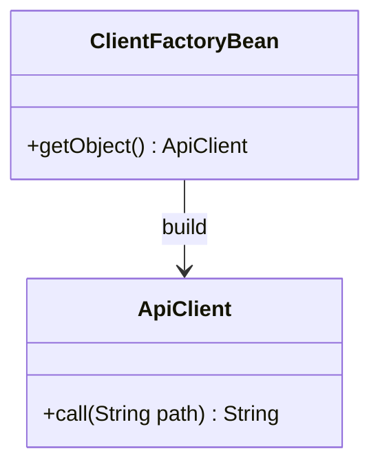

### Java 8 示例
```java
import org.springframework.beans.factory.FactoryBean;

class ApiClient {
    private final String baseUrl;

    ApiClient(String baseUrl) {
        this.baseUrl = baseUrl;
    }

    public String call(String path) {
        return "GET " + baseUrl + path;
    }
}

class ApiClientFactoryBean implements FactoryBean<ApiClient> {
    private String baseUrl;

    public void setBaseUrl(String baseUrl) { this.baseUrl = baseUrl; }

    @Override
    public ApiClient getObject() {
        return new ApiClient(baseUrl);
    }

    @Override
    public Class<?> getObjectType() {
        return ApiClient.class;
    }

    @Override
    public boolean isSingleton() {
        return true;
    }
}
```

### 说明
- 复杂初始化逻辑放进工厂，不污染业务类。
- Spring 管理工厂生命周期，你只关心参数和对象构建规则。

---

## 3. 代理模式（Proxy）

### Spring 对应
- AOP、`@Transactional`、`@Cacheable`。

### 典型场景
- 给核心业务“无侵入”加日志、事务、权限。

### 类图
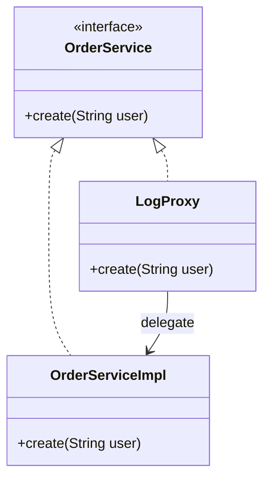

### Java 8 示例（JDK 动态代理）
```java
import java.lang.reflect.*;

interface OrderService {
    void create(String user);
}

class OrderServiceImpl implements OrderService {
    public void create(String user) {
        System.out.println("create order for " + user);
    }
}

public class ProxyDemo {
    public static void main(String[] args) {
        OrderService target = new OrderServiceImpl();

        OrderService proxy = (OrderService) Proxy.newProxyInstance(
                target.getClass().getClassLoader(),
                new Class<?>[]{OrderService.class},
                (Object p, Method m, Object[] a) -> {
                    System.out.println("[log] before " + m.getName());
                    Object r = m.invoke(target, a);
                    System.out.println("[log] after " + m.getName());
                    return r;
                }
        );

        proxy.create("alice");
    }
}
```

### 说明
- 代理对象和目标对象实现同一接口，对外透明。
- AOP 本质就是“调用前后插入增强逻辑”。

---

## 4. 模板方法模式（Template Method）

### Spring 对应
- `JdbcTemplate` / `RedisTemplate` / `RestTemplate`。

### 典型场景
- 流程固定（打开资源、执行、关闭），局部步骤可定制。

### 类图
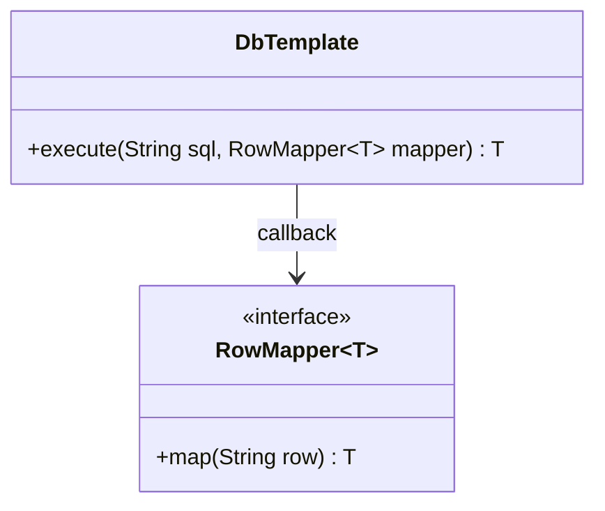

### Java 8 示例
```java
import java.util.function.Function;

class DbTemplate {
    public <T> T execute(String rowData, Function<String, T> mapper) {
        // 固定流程（简化版）：读取 -> 映射 -> 返回
        return mapper.apply(rowData);
    }
}

public class TemplateDemo {
    public static void main(String[] args) {
        DbTemplate template = new DbTemplate();
        Integer age = template.execute("18", Integer::valueOf);
        System.out.println(age + 2); // 20
    }
}
```

### 说明
- “不变部分”放模板中，“可变部分”通过回调或函数式接口注入。
- Java 8 的 Lambda 让模板回调更简洁。

---

## 5. 观察者模式（Observer）

### Spring 对应
- `ApplicationEventPublisher` + `@EventListener`。

### 典型场景
- 订单创建后触发短信、邮件、积分更新，彼此解耦。

### 类图
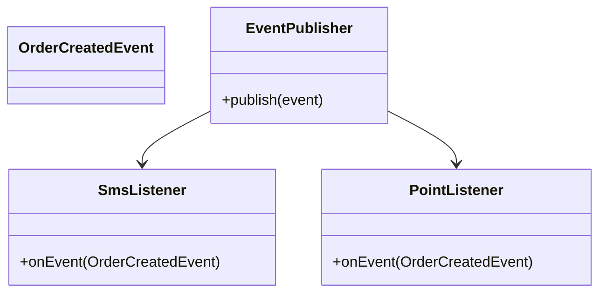

### Java 8 示例（简化版观察者）
```java
import java.util.*;
import java.util.function.Consumer;

class EventBus {
    private final List<Consumer<String>> listeners = new ArrayList<>();

    public void register(Consumer<String> listener) {
        listeners.add(listener);
    }

    public void publish(String event) {
        listeners.forEach(l -> l.accept(event));
    }
}

public class ObserverDemo {
    public static void main(String[] args) {
        EventBus bus = new EventBus();
        bus.register(e -> System.out.println("[sms] " + e));
        bus.register(e -> System.out.println("[point] " + e));
        bus.publish("order-created:1001");
    }
}
```

### 说明
- 发布者只管“发事件”，不关心有多少监听器、谁在处理。
- 有助于削减业务耦合、提升扩展性。

---

## 6. 适配器模式（Adapter）

### Spring 对应
- Spring MVC `HandlerAdapter`。

### 典型场景
- 统一调用不同风格 Controller 或历史接口。

### 类图
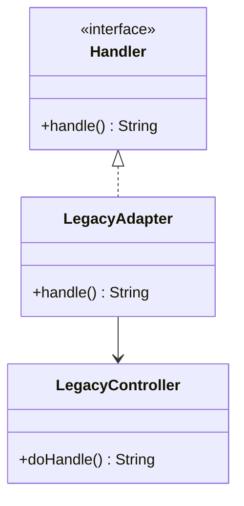

### Java 8 示例
```java
interface Handler {
    String handle();
}

class LegacyController {
    public String doHandle() {
        return "legacy-result";
    }
}

class LegacyAdapter implements Handler {
    private final LegacyController legacy;

    LegacyAdapter(LegacyController legacy) {
        this.legacy = legacy;
    }

    public String handle() {
        return legacy.doHandle();
    }
}

public class AdapterDemo {
    public static void main(String[] args) {
        Handler h = new LegacyAdapter(new LegacyController());
        System.out.println(h.handle());
    }
}
```

### 说明
- 适配器将“不兼容接口”转换为“目标接口”。
- 非常适合旧系统迁移与协议兼容。

---

## 7. 策略模式（Strategy）

### Spring 对应
- 同一接口多个实现 + `@Qualifier` / `Map<String, Strategy>` 注入选择。

### 典型场景
- 支付、优惠计算、风控规则切换。

### 类图
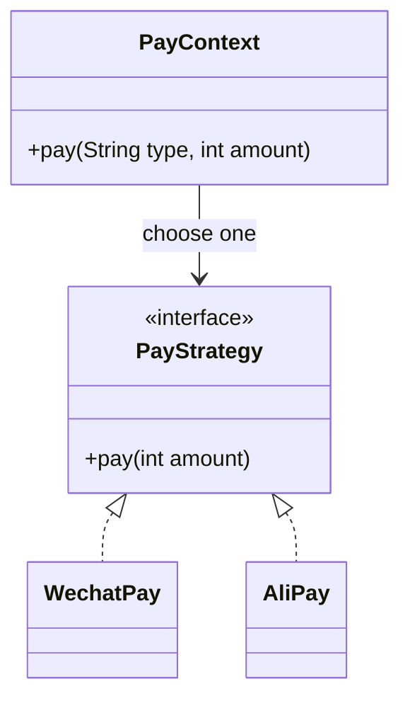

### Java 8 示例
```java
import java.util.*;

interface PayStrategy {
    void pay(int amount);
}

class WechatPay implements PayStrategy {
    public void pay(int amount) { System.out.println("wechat pay " + amount); }
}

class AliPay implements PayStrategy {
    public void pay(int amount) { System.out.println("alipay pay " + amount); }
}

class PayContext {
    private final Map<String, PayStrategy> strategies;

    PayContext(Map<String, PayStrategy> strategies) {
        this.strategies = strategies;
    }

    public void pay(String type, int amount) {
        Optional.ofNullable(strategies.get(type))
                .orElseThrow(() -> new IllegalArgumentException("unknown type"))
                .pay(amount);
    }
}
```

### 说明
- 把“if-else 分支逻辑”拆到多个策略实现中。
- 增加新策略时，尽量不改原有流程代码。

---

## 8. 责任链模式（Chain of Responsibility）

### Spring 对应
- Filter 链、Interceptor 链、Security Filter Chain。

### 典型场景
- 请求依次经过鉴权、日志、参数校验、审计。

### 类图
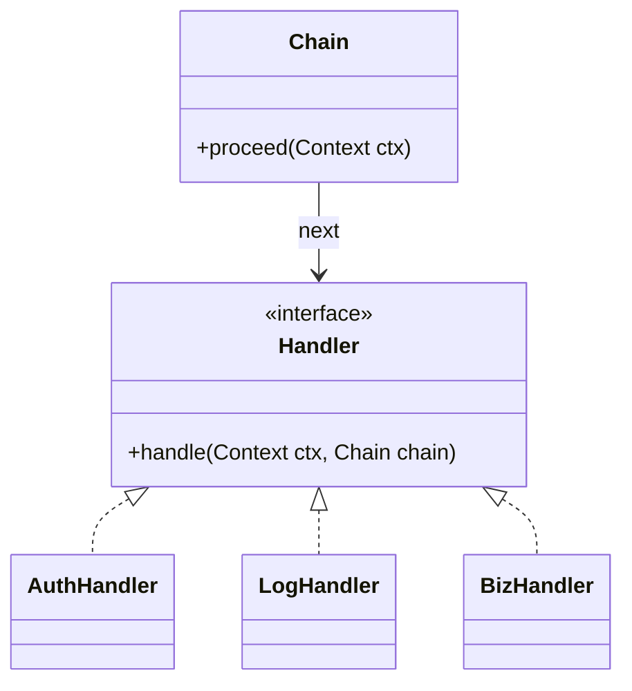

### Java 8 示例
```java
import java.util.*;

class Context {
    final String user;
    Context(String user) { this.user = user; }
}

interface Handler {
    void handle(Context c, Chain chain);
}

class Chain {
    private final List<Handler> handlers;
    private int index = 0;

    Chain(List<Handler> handlers) { this.handlers = handlers; }

    public void proceed(Context c) {
        if (index < handlers.size()) {
            handlers.get(index++).handle(c, this);
        }
    }
}
```

```java
class AuthHandler implements Handler {
    public void handle(Context c, Chain chain) {
        if (c.user == null) throw new RuntimeException("unauthorized");
        System.out.println("auth ok");
        chain.proceed(c);
    }
}

class LogHandler implements Handler {
    public void handle(Context c, Chain chain) {
        System.out.println("log user=" + c.user);
        chain.proceed(c);
    }
}

class BizHandler implements Handler {
    public void handle(Context c, Chain chain) {
        System.out.println("biz done");
    }
}
```

### 说明
- 每个处理器只关注自己的职责，顺序可配置。
- 链路可插拔，扩展统一逻辑时非常高效。

---

## 9. 装饰器模式（Decorator）

### Spring 对应
- `HttpServletRequestWrapper`、各种包装器。

### 典型场景
- 给对象动态叠加能力，不改原类。

### 类图
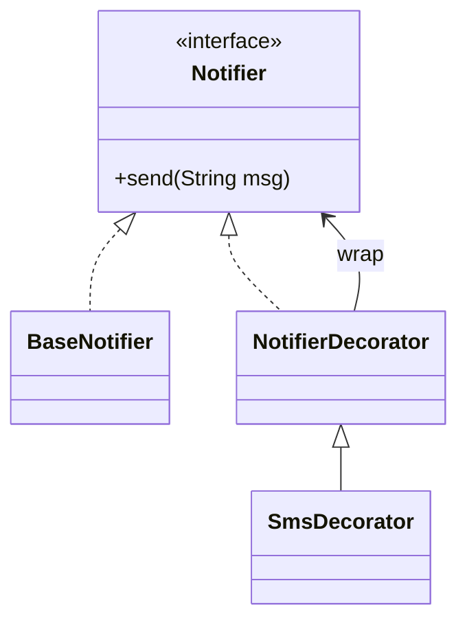

### Java 8 示例
```java
interface Notifier {
    void send(String msg);
}

class BaseNotifier implements Notifier {
    public void send(String msg) {
        System.out.println("email: " + msg);
    }
}

abstract class NotifierDecorator implements Notifier {
    protected final Notifier delegate;
    NotifierDecorator(Notifier delegate) { this.delegate = delegate; }
}

class SmsDecorator extends NotifierDecorator {
    SmsDecorator(Notifier delegate) { super(delegate); }

    public void send(String msg) {
        delegate.send(msg);
        System.out.println("sms: " + msg);
    }
}
```

### 说明
- 与继承相比，装饰器更灵活，可按需组合多层增强。
- 常用于“核心能力 + 附加通知/监控/缓存”。

---

## 10. 门面模式（Facade）

### Spring 对应
- `JdbcTemplate` / `RestTemplate` 对复杂 API 提供统一入口。

### 典型场景
- 对外暴露简单调用，隐藏内部多个子系统细节。

### 类图
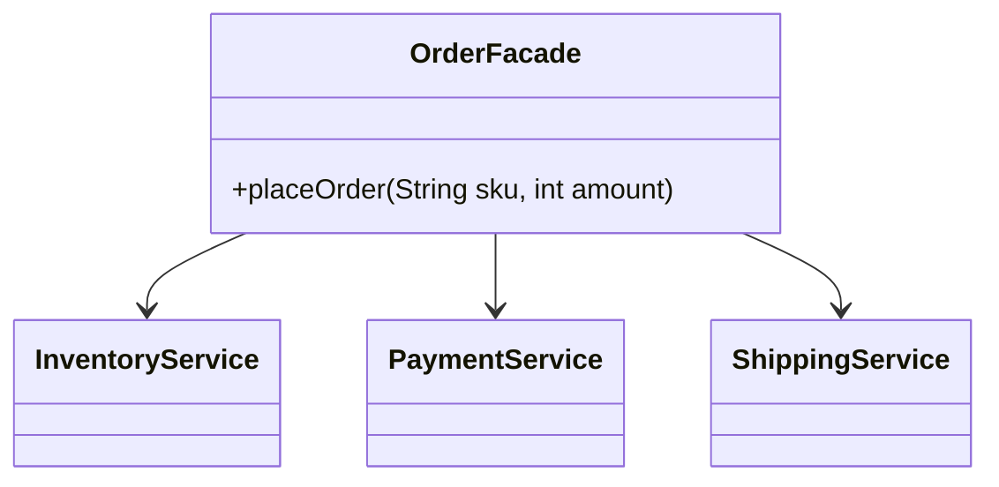

### Java 8 示例
```java
class InventoryService { boolean reserve(String sku) { return true; } }
class PaymentService { boolean pay(int amount) { return true; } }
class ShippingService { void ship(String sku) { System.out.println("ship " + sku); } }

class OrderFacade {
    private final InventoryService inventory = new InventoryService();
    private final PaymentService payment = new PaymentService();
    private final ShippingService shipping = new ShippingService();

    public boolean placeOrder(String sku, int amount) {
        if (!inventory.reserve(sku)) return false;
        if (!payment.pay(amount)) return false;
        shipping.ship(sku);
        return true;
    }
}
```

### 说明
- 客户端不需要知道内部步骤顺序与失败补偿细节。
- 非常适合做“应用服务层”统一编排。

---

## 11. 组合模式（Composite）

### Spring 对应
- `ApplicationContext` 层次容器结构（父子上下文）。

### 典型场景
- 树形结构：菜单、组织架构、文件目录。

### 类图
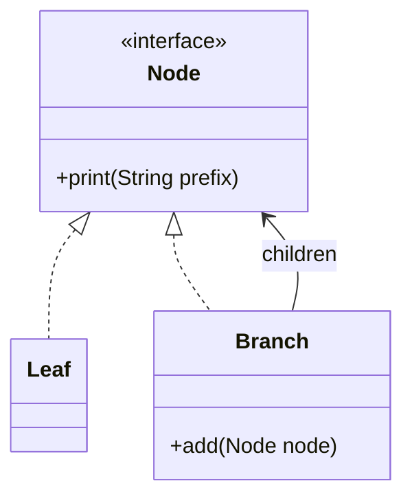

### Java 8 示例
```java
import java.util.*;

interface Node {
    void print(String prefix);
}

class Leaf implements Node {
    private final String name;
    Leaf(String name) { this.name = name; }

    public void print(String prefix) {
        System.out.println(prefix + "- " + name);
    }
}

class Branch implements Node {
    private final String name;
    private final List<Node> children = new ArrayList<>();

    Branch(String name) { this.name = name; }
    public void add(Node node) { children.add(node); }

    public void print(String prefix) {
        System.out.println(prefix + "+ " + name);
        children.forEach(c -> c.print(prefix + "  "));
    }
}
```

### 说明
- 组合模式让“单个对象”和“对象集合”使用方式一致。
- 递归处理树结构时非常自然。

---

## 12. 原型模式（Prototype）

### Spring 对应
- `@Scope("prototype")`。

### 典型场景
- 有状态、短生命周期对象，每次都需要新实例。

### 类图
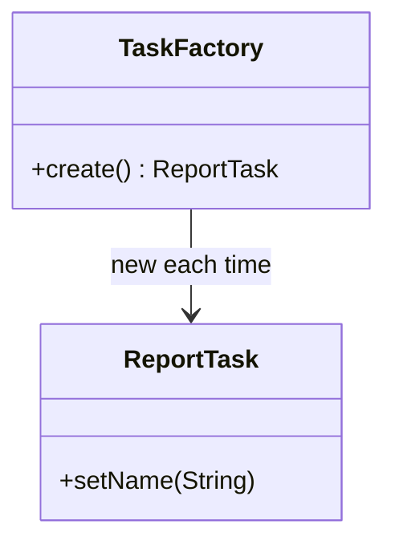

### Java 8 示例
```java
import org.springframework.context.annotation.*;

@Configuration
class ProtoConfig {
    @Bean
    @Scope("prototype")
    public ReportTask reportTask() {
        return new ReportTask();
    }
}

class ReportTask {
    private String name;
    public void setName(String name) { this.name = name; }
    public String getName() { return name; }
}

public class PrototypeDemo {
    public static void main(String[] args) {
        AnnotationConfigApplicationContext ctx = new AnnotationConfigApplicationContext(ProtoConfig.class);
        ReportTask t1 = ctx.getBean(ReportTask.class);
        ReportTask t2 = ctx.getBean(ReportTask.class);
        System.out.println(t1 == t2); // false
        ctx.close();
    }
}
```

### 说明
- 每次获取 Bean 都创建新对象，互不共享状态。
- 注意：原型 Bean 的销毁回调通常需要自行管理。

---

## 选型建议（面试/实战速记）

- **对象创建问题**：单例、工厂、原型。
- **行为扩展问题**：代理、装饰器。
- **流程复用问题**：模板方法。
- **系统解耦问题**：观察者、策略。
- **请求流转问题**：责任链、适配器。
- **复杂度收敛问题**：门面、组合。

---

## 一页总结表

| 模式 | Spring 典型位置 | 适合解决的问题 |
|---|---|---|
| 单例 | 默认 Bean Scope | 减少对象重复创建 |
| 工厂 | BeanFactory / FactoryBean | 复杂对象构建 |
| 代理 | AOP / 事务 / 缓存 | 横切增强 |
| 模板方法 | JdbcTemplate | 固定流程复用 |
| 观察者 | EventPublisher + Listener | 事件解耦 |
| 适配器 | HandlerAdapter | 接口兼容 |
| 策略 | 多实现 Bean 选择 | 算法切换 |
| 责任链 | Filter / Interceptor | 分步处理请求 |
| 装饰器 | Wrapper 系列 | 动态附加功能 |
| 门面 | Template 封装层 | 简化复杂子系统 |
| 组合 | 容器层级/树结构 | 统一处理整体与部分 |
| 原型 | prototype scope | 每次新建实例 |

